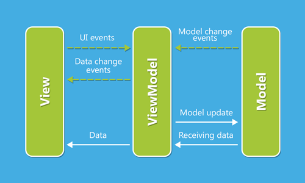

# Teste Mobile (Mobile test)

Foi desenvolvido uma solução Android nativo implementado em Kotlin que tem como objetivo o envio de dinheiro para uma outra pessoa via cartão de crédito, seguindo os requisitos impostos. Esta aplicação oferece suporte mínimo para a versão do Android 4.1 - Jelly Bean (API 16), que cobre cerca de 99% dos dipositivos atuais.

We developed a native Android solution implemented in Kotlin that aims to send money to another person via credit card, following the imposed requirements. This application offers minimal support for the Android 4.1 version - Jelly Bean (API 16), which covers about 99% of current devices.

-----
###### Padrão de projeto utilizado (Used design pattern)

Para este projeto foi utilizado o padrão de projeto MVVM (Model-View-ViewModel), de modo que para cada View existe uma ViewModel correspondente que se comunica com a camada Model, isolando assim as camadas View e Model e estabelecendo uma clara separação de responsabilidades.

For this project we used the MVVM (Model-View-ViewModel) design pattern, where for each View there is a corresponding ViewModel that communicates with the Model layer, thus isolating the View and Model layers and establishing a clear separation of responsibilities.

-----
###### Dependências utilizadas (Used dependencies)

+ LiveData & ViewModel
+ Retrofit
+ Gson
+ Dagger
+ ReactiveX
+ Glide
+ Circle ImageView
+ Room database
=======
# Desafio Mobile

Para mais informações sobre nosso desafio acesse:

https://picpay.com/jobs/desafio-mobile
