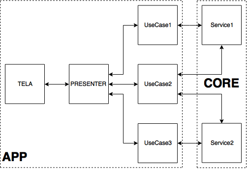
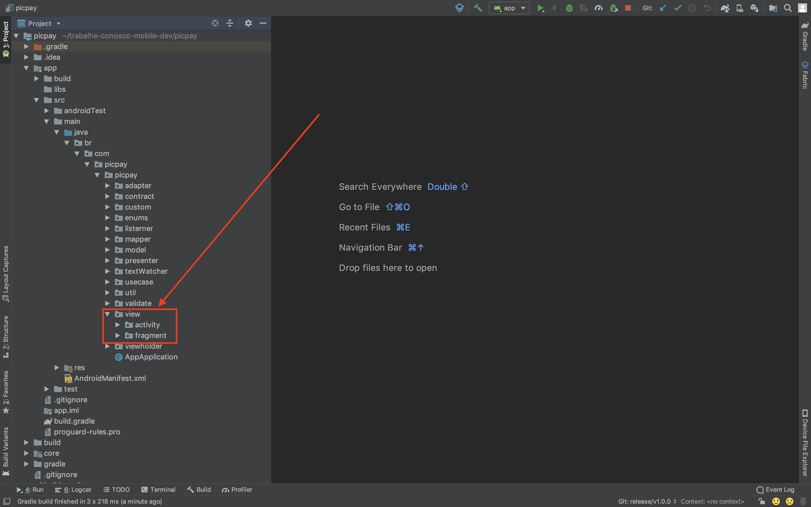
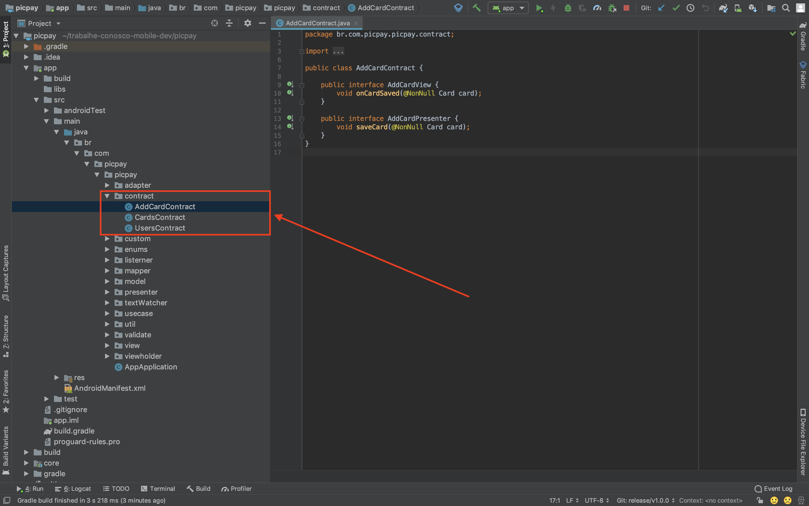
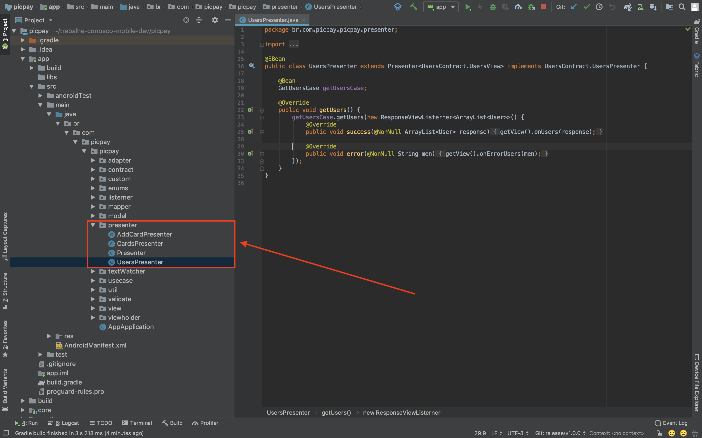
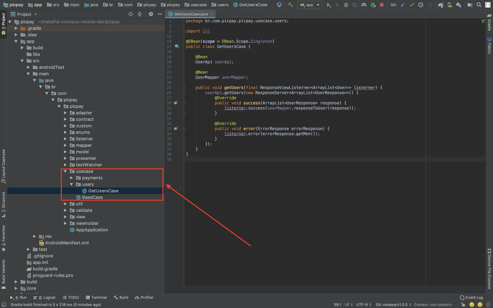
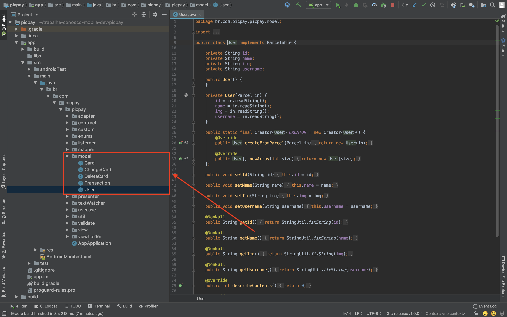
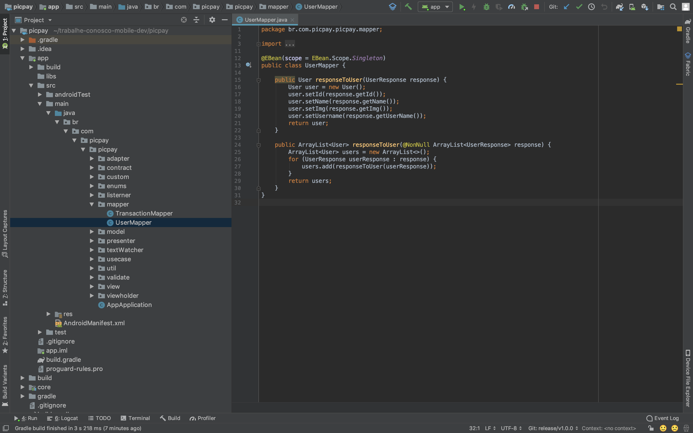
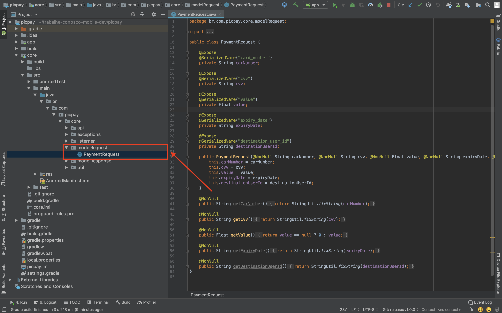
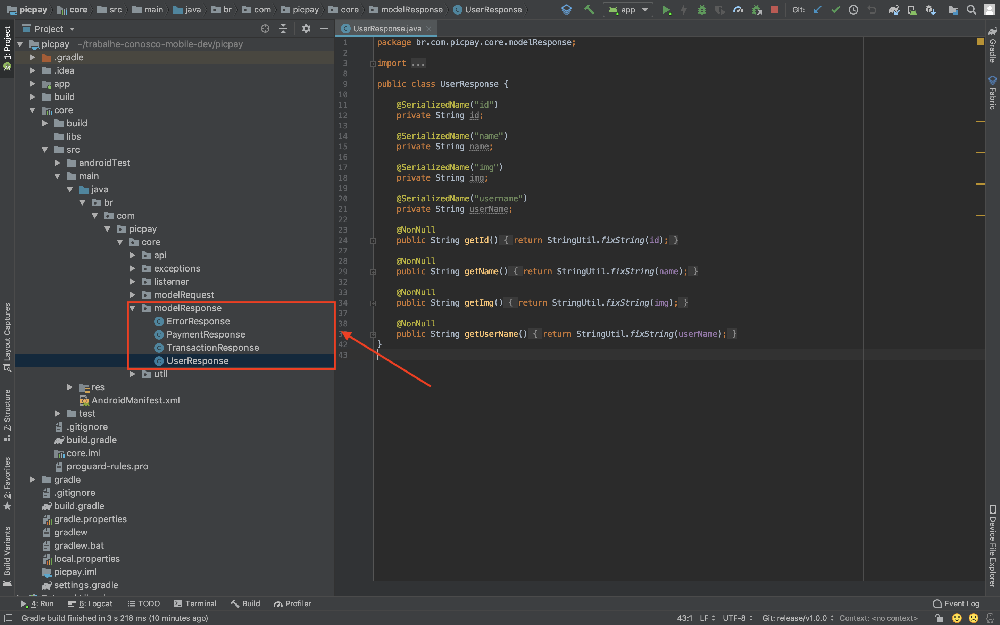
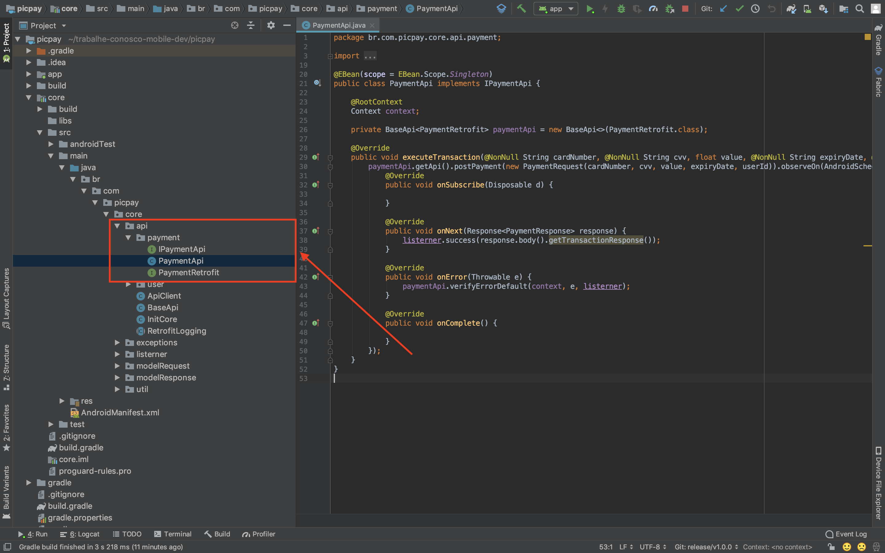

# Teste Mobile

O teste pode ser feito para iOS ou Android e é uma simulação de envio de dinheiro para uma outra pessoa via cartão de crédito.

BY: VICTOR MORAES

EMAIL: VICCTORMORAES@GMAIL.COM

# Entendendo o Projeto

Esse projeto utiliza o conceito MVP (Model View Presenter) com **UseCases**, ou seja, temos a camada da **View** que se comunica com o **Presenter** no qual se comunica com os **UseCases** e os mesmo se comunicam com os Serviços(**core**).

**APP**

* Tela - **View** responsável por mostrar informações ao usuário, como **Activity, Fragment, Dialog e etc**. 

* Contract - **Interface** responsável por garantir o **contrato entre o Presenter e a View**.

* Presenter - responsável por fazer a comunicação entre a **View** e os **UseCase**, **(NO PRESENTER NÃO VAI REGRA DE NEGÓCIO, POIS SE NÃO O USECASE FICA SEM EMPREGO)**

* UseCase - responsável por fazer a comunicação entre **Presenter** e o Serviço(**core**), sendo aqui onde fica as regras de negócios e conversão dos objetos entre **App e Core** utilizando os **Mapper**, **(NADA DE FAZER CONVERSÃO FORA DOS MAPPERS, POIS ELES PRECISAM DESSE EMPREGO)**

* Model - responsável por representar os dados de um Objeto para as **View**

* Mapper - responsável por converter o **ModelResponse do Core** em **Model do App**

**CORE**

* ModelRequest - Model que representa o conjunto de dados para uma requisição

* ModelResponse - Model que representa a resposta de uma requisição

* API - Classe que controla as chamadas 

